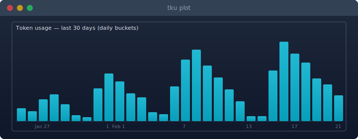

# TKU - Token Usage CLI

Token usage tracking for Claude Code, Codex, Gemini CLI and others.

<p align="center">
  
</p>
<p align="center">
  Scans local session files, fetches live pricing, and shows aggregated reports.
</p>

## Install

| Method | Command |
|--------|---------|
| Homebrew | `brew tap franzos/tap && brew install tku` |
| Debian/Ubuntu | Download [`.deb`](https://github.com/franzos/tku/releases) — `sudo dpkg -i tku_*_amd64.deb` |
| Fedora/RHEL | Download [`.rpm`](https://github.com/franzos/tku/releases) — `sudo rpm -i tku-*.x86_64.rpm` |
| Guix | `guix install -L <panther> tku` ([Panther channel](https://github.com/franzos/panther)) |
| Cargo | `cargo build --release` |

Pre-built binaries for Linux (x86_64), macOS (Apple Silicon, Intel) on [GitHub Releases](https://github.com/franzos/tku/releases).

## Quick start

```bash
# Daily usage (default)
tku

# Monthly aggregation
tku monthly

# Per-session breakdown
tku session

# Per-model costs
tku model

# Filter by date range
tku --from 2026-02-01 --to 2026-02-19

# Filter by project
tku --project my-project

# Filter by tool
tku --tool claude

# Per-model breakdown within each day
tku --breakdown

# Bar chart of token usage (last 30 days)
tku plot

# Live-updating cost monitor (today, compact)
tku watch

# Live-updating full table
tku watch --full
```

## Commands

| Command | Description |
|---------|-------------|
| `daily` | Aggregate by day (default) |
| `monthly` | Aggregate by month |
| `session` | Aggregate by session, grouped by project |
| `model` | Aggregate by model |
| `watch` | Live-updating cost monitor (default: compact single line, today only) |
| `plot` | Inline bar chart of token usage over time |
| `bar` | JSON output for status bars (waybar, i3bar, polybar) |

## Options

| Flag | Description |
|------|-------------|
| `--from <YYYY-MM-DD>` | Start date filter |
| `--to <YYYY-MM-DD>` | End date filter |
| `--project <name>` | Filter by project name (substring match) |
| `--tool <name>` | Filter by tool (claude, codex, pi, amp, opencode, gemini, droid, openclaw, kimi) |
| `--format table\|json` | Output format (default: table) |
| `--columns <cols>` | Columns to display (see below) |
| `--breakdown` | Per-model breakdown within each period |
| `--pricing-source <source>` | Pricing source: `litellm` (default), `openrouter`, `llmprices` |
| `--currency <CODE>` | Currency for cost display (ISO 4217, e.g. `EUR`, `GBP`) |
| `--offline` | Use cached pricing only |
| `--cli` | Suppress progress output (for scripting) |

### Columns

Available columns: `period`, `input`, `output`, `cache_write`, `cache_read`, `cost`, `models`, `tools`, `projects`

Default: `period,input,output,cache_write,cache_read,cost,models,tools`

Use `+`/`-` prefixes to modify defaults:

```bash
# Add projects column
tku --columns +projects

# Remove cache columns
tku --columns -cache_write,-cache_read

# Explicit list (replaces defaults)
tku --columns period,cost,models
```

## Watch mode

`tku watch` monitors provider session files and displays a running cost counter. Refreshes on file changes (via inotify/FSEvents/kqueue), debounced to avoid rapid redraws.

```bash
# Compact single-line output (default)
tku watch

# Full table, redrawn on each update
tku watch --full

# Custom refresh interval (seconds)
tku watch --interval 5

# Combine with filters
tku watch --tool claude --currency EUR
tku watch --full --breakdown --from 2026-02-01
```

| Flag | Description |
|------|-------------|
| `--full` | Show full table instead of compact summary line |
| `--interval <seconds>` | Minimum time between refreshes (default: 2) |

## Plot

`tku plot` renders an inline bar chart of total token usage over time, then exits. No interactive TUI — it prints the chart and returns to your prompt.

<p align="center">
  
</p>

```bash
# Last 30 days, daily buckets (default)
tku plot

# Last 24 hours, 30-minute buckets
tku plot 1d

# Last 7 days, 6-hour buckets
tku plot 1w

# Relative window (no clock alignment)
tku plot 1d --relative

# Combine with filters
tku plot --project my-project
tku plot 1w --tool claude
```

| Period | Range | Buckets | Labels |
|--------|-------|---------|--------|
| `1m` (default) | 30 days | 30 daily | Day number, month on 1st |
| `1w` | 7 days | 28 x 6h | Day name at midnight |
| `1d` | 24 hours | 48 x 30min | Hour on the hour |

By default, buckets align to the local clock (e.g. `1d` at 08:00 shows 08:00 yesterday through now). Use `--relative` to ignore clock alignment and take the exact last N hours/days.

## Status bar integration

The `bar` subcommand outputs JSON for waybar, i3bar, or polybar:

```bash
tku bar
# {"text":"$34.58","tooltip":"Today: $34.58\n  opus-4-6: $29.95\n  sonnet-4-5: $3.49","class":"normal","currency":"USD"}
```

| Flag | Description |
|------|-------------|
| `--period today\|week\|month` | Timeframe (default: today) |
| `--template "{cost}"` | Format string. Placeholders: `{cost}`, `{input}`, `{output}`, `{models}`, `{projects}` |
| `--warn <amount>` | Cost threshold for `"warning"` class (in display currency) |
| `--critical <amount>` | Cost threshold for `"critical"` class (in display currency) |

**Waybar config:**

```json
"custom/llm": {
    "exec": "tku bar --period today --warn 50 --critical 100",
    "interval": 5,
    "return-type": "json"
}
```

## Storage backends

tku caches parsed session data so repeated runs skip unchanged files. Two backends are available, selected at compile time.

### Bitcode (default)

Binary serialization using [bitcode](https://crates.io/crates/bitcode). One file per provider in `~/.cache/tku/`.

```bash
cargo build --release
```

### SQLite

SQLite with WAL mode. Single database file at `~/.cache/tku/records.db`.

```bash
cargo build --release --features sqlite
```

### Comparison

Benchmarked on ~3,900 session files, ~80K usage records:

| | Bitcode | SQLite |
|---|---------|--------|
| Cold start (first run, no cache) | ~21s | ~30s |
| Warm start (cached) | ~0.6s | ~0.6s |
| Cache size | 40 MB | 112 MB |

Both backends perform equally well for repeated runs. Bitcode is the default because it has a faster cold start and smaller cache footprint. SQLite may be useful if you want to query the cache directly.

## Configuration

Optional config file at `~/.config/tku/config.toml`:

```toml
pricing_source = "litellm"  # litellm | openrouter | llmprices
currency = "EUR"             # any ISO 4217 code
```

Both keys are optional. CLI flags (`--pricing-source`, `--currency`) override config file values.

## Pricing

Three pricing sources are available:

| Source | Description |
|--------|-------------|
| `litellm` | [LiteLLM](https://github.com/BerriAI/litellm) model prices (default) |
| `openrouter` | [OpenRouter](https://openrouter.ai) API pricing |
| `llmprices` | [LLM Prices](https://llm-prices.com) aggregated pricing |

Pricing data is cached for 24 hours at `~/.cache/tku/pricing-<source>.json`. Use `--offline` to skip the fetch and rely on the cached file.

## Currency

Costs default to USD. Set a different currency via `--currency` or the config file. Exchange rates are fetched from the [Frankfurter API](https://frankfurter.dev) (ECB data, no auth required) and cached for 7 days. On failure, stale cache is used if available, otherwise falls back to USD.

## Providers

Currently supported:

- **Claude Code** — scans `~/.claude/projects/**/*.jsonl` and `~/.config/claude/projects/**/*.jsonl`
- **OpenAI Codex CLI** — scans `~/.codex/sessions/**/*.jsonl` (override with `CODEX_HOME`)
- **Pi-agent** — scans `~/.pi/agent/sessions/**/*.jsonl` (override with `PI_AGENT_DIR`)
- **Amp** — scans `~/.local/share/amp/threads/**/*.json` (override with `AMP_DATA_DIR`)
- **OpenCode** — scans `~/.local/share/opencode/storage/message/**/*.json` (override with `OPENCODE_DATA_DIR`); SQLite (`opencode.db`) with `--features sqlite`
- **Gemini CLI** — scans `~/.gemini/tmp/*/chats/session-*.json` (override with `GEMINI_HOME`)
- **Droid (Factory)** — scans `~/.factory/sessions/*.settings.json` (override with `FACTORY_HOME`)
- **OpenClaw** — scans `~/.openclaw/agents/**/*.jsonl` (+ legacy: clawdbot, moltbot, moldbot)
- **Kimi CLI** — scans `~/.kimi/sessions/**/wire.jsonl` (override with `KIMI_HOME`)

The provider architecture is designed so adding a new provider is a single file in `src/providers/`.

## Building

```bash
# Default (bitcode backend)
cargo build --release

# With SQLite backend
cargo build --release --features sqlite

# Run tests
cargo test
```

## Alternatives

| Tool | Language | Providers | Currency | Pricing sources | Watch/live | Plot | Status bar | JSON output |
|------|----------|-----------|----------|-----------------|------------|------|------------|-------------|
| **[tku](https://github.com/franzos/tku)** | Rust | Claude Code, Codex, Pi, Amp, OpenCode, Gemini CLI, Droid, OpenClaw, Kimi | Yes (any ISO 4217) | LiteLLM, OpenRouter, LLM Prices | Yes (file-watcher) | Yes | Yes (waybar/i3/polybar) | Yes |
| **[ccusage](https://github.com/ryoppippi/ccusage)** | TypeScript | Claude Code, Codex, Pi, Amp, OpenCode | No | LiteLLM | No | No | Yes (CC statusline) | Yes |
| **[better-ccusage](https://github.com/cobra91/better-ccusage)** | TypeScript | Claude Code + Moonshot, MiniMax, Zai, GLM | No | Bundled | Yes (`blocks --live`) | No | No | Yes |
| **[toktrack](https://github.com/mag123c/toktrack)** | Rust | Claude Code, Codex, Gemini CLI, OpenCode | No | LiteLLM | No (TUI) | No | No | Yes |
| **[tokscale](https://github.com/junhoyeo/tokscale)** | Rust + TS | Claude Code, Codex, Cursor, Gemini CLI, Amp, Pi, OpenCode, Kimi, OpenClaw, Droid | No | LiteLLM + OpenRouter fallback | Yes (auto-refresh) | No | No | Yes |
| **[caut](https://github.com/Dicklesworthstone/coding_agent_usage_tracker)** | Rust | 16+ (Codex, Claude, Gemini, Cursor, Copilot, Kiro, ...) | No | Local JSONL + provider APIs | No | No | No | Yes + Markdown |
| **[claude-monitor](https://github.com/Maciek-roboblog/Claude-Code-Usage-Monitor)** | Python | Claude Code only | No | Bundled | Yes (real-time TUI) | No | No | No |

## Acknowledgements

Inspired by [ccusage](https://github.com/ryoppippi/ccusage).

## License

MIT
