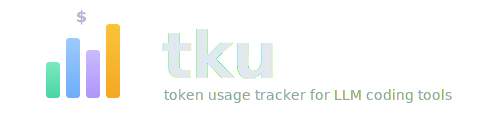

# TKU - Token Usage CLI

Token usage tracking for Claude Code, Codex and others.

<p align="center">
  
</p>
<p align="center">
  Scans local session files, fetches live pricing, and shows aggregated reports.
</p>

## Install

**Pre-built binaries:**

Download the latest release from [GitHub Releases](https://github.com/franzos/tku/releases) and extract the binary to a directory in your `PATH`:

```bash
# macOS (Apple Silicon)
curl -sL https://github.com/franzos/tku/releases/latest/download/tku-aarch64-apple-darwin.tar.gz | tar xz
sudo mv tku /usr/local/bin/

# macOS (Intel)
curl -sL https://github.com/franzos/tku/releases/latest/download/tku-x86_64-apple-darwin.tar.gz | tar xz
sudo mv tku /usr/local/bin/

# Linux (x86_64)
curl -sL https://github.com/franzos/tku/releases/latest/download/tku-x86_64-unknown-linux-gnu.tar.gz | tar xz
sudo mv tku /usr/local/bin/
```

**From source:**

```bash
cargo build --release
cp target/release/tku ~/.local/bin/
```

## Quick start

```bash
# Daily usage (default)
tku

# Monthly aggregation
tku monthly

# Per-session breakdown
tku session

# Per-model costs
tku model

# Filter by date range
tku --from 2026-02-01 --to 2026-02-19

# Filter by project
tku --project my-project

# Filter by tool
tku --tool claude

# Per-model breakdown within each day
tku --breakdown
```

## Commands

| Command | Description |
|---------|-------------|
| `daily` | Aggregate by day (default) |
| `monthly` | Aggregate by month |
| `session` | Aggregate by session, grouped by project |
| `model` | Aggregate by model |
| `bar` | JSON output for status bars (waybar, i3bar, polybar) |

## Options

| Flag | Description |
|------|-------------|
| `--from <YYYY-MM-DD>` | Start date filter |
| `--to <YYYY-MM-DD>` | End date filter |
| `--project <name>` | Filter by project name (substring match) |
| `--tool <name>` | Filter by tool (claude, codex, pi, amp, opencode) |
| `--format table\|json` | Output format (default: table) |
| `--columns <cols>` | Columns to display (see below) |
| `--breakdown` | Per-model breakdown within each period |
| `--pricing-source <source>` | Pricing source: `litellm` (default), `openrouter`, `llmprices` |
| `--currency <CODE>` | Currency for cost display (ISO 4217, e.g. `EUR`, `GBP`) |
| `--offline` | Use cached pricing only |
| `--cli` | Suppress progress output (for scripting) |

### Columns

Available columns: `period`, `input`, `output`, `cache_write`, `cache_read`, `cost`, `models`, `tools`, `projects`

Default: `period,input,output,cache_write,cache_read,cost,models,tools`

Use `+`/`-` prefixes to modify defaults:

```bash
# Add projects column
tku --columns +projects

# Remove cache columns
tku --columns -cache_write,-cache_read

# Explicit list (replaces defaults)
tku --columns period,cost,models
```

## Status bar integration

The `bar` subcommand outputs JSON for waybar, i3bar, or polybar:

```bash
tku bar
# {"text":"$34.58","tooltip":"Today: $34.58\n  opus-4-6: $29.95\n  sonnet-4-5: $3.49","class":"normal","currency":"USD"}
```

| Flag | Description |
|------|-------------|
| `--period today\|week\|month` | Timeframe (default: today) |
| `--template "{cost}"` | Format string. Placeholders: `{cost}`, `{input}`, `{output}`, `{models}`, `{projects}` |
| `--warn <amount>` | Cost threshold for `"warning"` class (in display currency) |
| `--critical <amount>` | Cost threshold for `"critical"` class (in display currency) |

**Waybar config:**

```json
"custom/llm": {
    "exec": "tku bar --period today --warn 50 --critical 100",
    "interval": 5,
    "return-type": "json"
}
```

## Storage backends

tku caches parsed session data so repeated runs skip unchanged files. Two backends are available, selected at compile time.

### Bitcode (default)

Binary serialization using [bitcode](https://crates.io/crates/bitcode). One file per provider in `~/.cache/tku/`.

```bash
cargo build --release
```

### SQLite

SQLite with WAL mode. Single database file at `~/.cache/tku/records.db`.

```bash
cargo build --release --features sqlite
```

### Comparison

Benchmarked on ~3,900 session files, ~80K usage records:

| | Bitcode | SQLite |
|---|---------|--------|
| Cold start (first run, no cache) | ~21s | ~30s |
| Warm start (cached) | ~0.6s | ~0.6s |
| Cache size | 40 MB | 112 MB |

Both backends perform equally well for repeated runs. Bitcode is the default because it has a faster cold start and smaller cache footprint. SQLite may be useful if you want to query the cache directly.

## Configuration

Optional config file at `~/.config/tku/config.toml`:

```toml
pricing_source = "litellm"  # litellm | openrouter | llmprices
currency = "EUR"             # any ISO 4217 code
```

Both keys are optional. CLI flags (`--pricing-source`, `--currency`) override config file values.

## Pricing

Three pricing sources are available:

| Source | Description |
|--------|-------------|
| `litellm` | [LiteLLM](https://github.com/BerriAI/litellm) model prices (default) |
| `openrouter` | [OpenRouter](https://openrouter.ai) API pricing |
| `llmprices` | [LLM Prices](https://llm-prices.com) aggregated pricing |

Pricing data is cached for 24 hours at `~/.cache/tku/pricing-<source>.json`. Use `--offline` to skip the fetch and rely on the cached file.

## Currency

Costs default to USD. Set a different currency via `--currency` or the config file. Exchange rates are fetched from the [Frankfurter API](https://frankfurter.dev) (ECB data, no auth required) and cached for 7 days. On failure, stale cache is used if available, otherwise falls back to USD.

## Providers

Currently supported:

- **Claude Code** — scans `~/.claude/projects/**/*.jsonl` and `~/.config/claude/projects/**/*.jsonl`
- **OpenAI Codex CLI** — scans `~/.codex/sessions/**/*.jsonl` (override with `CODEX_HOME`)
- **Pi-agent** — scans `~/.pi/agent/sessions/**/*.jsonl` (override with `PI_AGENT_DIR`)
- **Amp** — scans `~/.local/share/amp/threads/**/*.json` (override with `AMP_DATA_DIR`)
- **OpenCode** — scans `~/.local/share/opencode/storage/message/**/*.json` (override with `OPENCODE_DATA_DIR`)

The provider architecture is designed so adding a new provider is a single file in `src/providers/`.

## Building

```bash
# Default (bitcode backend)
cargo build --release

# With SQLite backend
cargo build --release --features sqlite

# Run tests
cargo test
```

## Acknowledgements

Inspired by [ccusage](https://github.com/ryoppippi/ccusage).

## License

MIT
