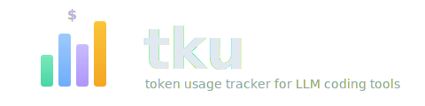

# TKU - Token Usage CLI

Token usage tracking for Claude Code, Codex, Gemini CLI and others.

<p align="center">
  
</p>
<p align="center">
  Scans local session files, fetches live pricing, and shows aggregated reports.
</p>
<p align="center">
  <a href="https://scorecard.dev/viewer/?uri=github.com/franzos/tku"></a>
</p>

## Install

| Method | Command |
|--------|---------|
| Homebrew | `brew tap franzos/tap && brew install tku` |
| Debian/Ubuntu | Download [`.deb`](https://github.com/franzos/tku/releases) — `sudo dpkg -i tku_*_amd64.deb` |
| Fedora/RHEL | Download [`.rpm`](https://github.com/franzos/tku/releases) — `sudo rpm -i tku-*.x86_64.rpm` |
| Guix | `guix install -L <panther> tku` ([Panther channel](https://github.com/franzos/panther)) |
| Cargo | `cargo build --release` |

Pre-built binaries for Linux (x86_64), macOS (Apple Silicon, Intel) on [GitHub Releases](https://github.com/franzos/tku/releases).

## Quick start

```bash
# Daily usage (default)
tku

# Monthly aggregation
tku monthly

# Per-session breakdown
tku session

# Per-model costs
tku model

# Per-model burn rate (tokens/min, $/active-hour, $/calendar-day)
tku model-burn

# Filter by date range
tku --from 2026-02-01 --to 2026-02-19

# Filter by project
tku --project my-project

# Filter by tool
tku --tool claude

# Per-model breakdown within each day
tku --breakdown

# Subscription usage overview (Claude Max/Pro)
tku sub

# One-row-per-account overview across all registered Claude accounts
tku sub --all

# Upgrade/downgrade recommendation based on your usage history
tku sub --plan

# Manage multiple Claude accounts
tku account list
tku account use work

# Filter any report to one account
tku monthly --account work

# Run a one-shot session as another account, isolated (without switching your login)
tku account exec personal -- claude

# Bar chart of token usage (last 30 days)
tku plot

# Live-updating cost monitor (today, compact)
tku watch

# Live-updating full table
tku watch --full
```

## Commands

| Command | Description |
|---------|-------------|
| `daily` | Aggregate by day (default) |
| `monthly` | Aggregate by month |
| `session` | Aggregate by session, grouped by project |
| `model` | Aggregate by model |
| `model-burn` | Per-model burn rate (active-time and calendar rates) |
| `watch` | Live-updating cost monitor (default: compact single line, today only) |
| `plot` | Inline bar chart of token usage over time |
| `subscription` (`sub`) | Claude Max/Pro subscription usage overview |
| `account` | Manage stashed Claude accounts (add/use/list/current/rename/remove/exec) |
| `bar` | JSON output for status bars (waybar, i3bar, polybar) |

## Options

| Flag | Description |
|------|-------------|
| `--from <YYYY-MM-DD>` | Start date filter |
| `--to <YYYY-MM-DD>` | End date filter |
| `--project <name>` | Filter by project name (substring match) |
| `--tool <name>` | Filter by tool (claude, codex, pi, amp, opencode, gemini, droid, openclaw, kimi) |
| `--account <name>` | Filter records to a stashed Claude account (see [Accounts](#accounts)) |
| `--format table\|json` | Output format (default: table) |
| `--columns <cols>` | Columns to display (see below) |
| `--breakdown` | Per-model breakdown within each period |
| `--pricing-source <source>` | Pricing source: `litellm` (default), `openrouter`, `llmprices` |
| `--currency <CODE>` | Currency for cost display (ISO 4217, e.g. `EUR`, `GBP`) |
| `--offline` | Use cached pricing only |
| `--cli` | Suppress progress output (for scripting) |

### Columns

Available columns: `period`, `input`, `output`, `cache_write`, `cache_read`, `cost`, `models`, `tools`, `projects`

Default: `period,input,output,cache_write,cache_read,cost,models,tools`

Use `+`/`-` prefixes to modify defaults:

```bash
# Add projects column
tku --columns +projects

# Remove cache columns
tku --columns -cache_write,-cache_read

# Explicit list (replaces defaults)
tku --columns period,cost,models
```

## Watch mode

`tku watch` monitors provider session files and displays a running cost counter. Refreshes on file changes (via inotify/FSEvents/kqueue), debounced to avoid rapid redraws.

```bash
# Compact single-line output (default)
tku watch

# Full table, redrawn on each update
tku watch --full

# Custom refresh interval (seconds)
tku watch --interval 5

# Combine with filters
tku watch --tool claude --currency EUR
tku watch --full --breakdown --from 2026-02-01
```

| Flag | Description |
|------|-------------|
| `--full` | Show full table instead of compact summary line |
| `--interval <seconds>` | Minimum time between refreshes (default: 2) |

## Model burn

`tku model-burn` answers a different question than `tku model`: not "what did each model cost," but "how hard does each model work, and what does it cost to keep it running." It shows two kinds of rate side by side.

The active-time rates (`tok/min`, `$/act-hr`) measure consumption *while you're actually working*. Active time is the sum of gaps between consecutive messages, with long idle pauses clamped — by default any gap over 5 minutes counts as 5 minutes, so going for coffee doesn't dilute the rate. Tune that with `--idle-gap` (in minutes); pass something large like `--idle-gap 9999` to recover raw session-span behaviour.

The calendar rate (`$/cal-day`) is sustained spend: total cost divided by the number of distinct local days the model ran. Good for "am I on track for my monthly budget."

```bash
# Default 5-minute idle cap
tku model-burn

# Treat pauses up to 30 minutes as active
tku model-burn --idle-gap 30

# Combine with the usual filters
tku model-burn --tool claude --from 2026-05-01
```

A couple of honest caveats. Per-model active time groups by `(session, model)`, while the `ALL` row groups by session only — so when you mix models in one session, the per-model active times intentionally won't add up to the `ALL` total. And if any record of a model lacks pricing, its cost column shows `N/A` rather than an undercount; a `–` in a rate column just means there wasn't enough data to compute it.

## Plot

`tku plot` renders an inline bar chart of total token usage over time, then exits. No interactive TUI — it prints the chart and returns to your prompt.

```
┌Token usage — last 30 days (daily buckets)──────────────────────────────────────┐
│                                                                ███             │
│                                                                ███             │
│▅▅▅                                                             ███             │
│███                             ▁▁▁                             ███             │
│███                         ▆▆▆ ███                             ███             │
│███                         ███ ███                             ███     ▅▅▅  ···│
│███                     ███ ███ ███ ▁▁▁                     ▇▇▇ ███     ███  ···│
│███                 ▆▆▆ ███ ███ ███ ███ ▅▅▅             ▇▇▇ ███ ███     ███  ···│
│███                 ███ ███ ███ ███ ███ ███             ███ ███ ███ ▆▆▆ ███  ···│
│███     ▅▅▅         ███ ███ ███ ███ ███ ███ ███         ███ ███ ███ ███ ███  ···│
│███     ███         ███ ███ ███ ███ ███ ███ ███ ▂▂▂     ███ ███ ███ ███ ███  ···│
│███ ▁▁▁ ███ ▁▁▁ ▆▆▆ ███ ███ ███ ███ ███ ███ ███ ███ ▃▃▃ ███ ███ ███ ███ ███  ···│
│███ ███ ███ ███ ███ ███ ███ ███ ███ ███ ███ ███ ███ ███ ███ ███ ███ ███ ███  ···│
│███ ███ ███ ███ ███ ███ ███ ███ ███ ███ ███ ███ ███ ███ ███ ███ ███ ███ ███  ···│
│Feb  6   7   8   9  10  11  12  13  14  15  16  17  18  19  20  21  22  23   ···│
└────────────────────────────────────────────────────────────────────────────────┘
```

```bash
# Last 30 days, daily buckets (default)
tku plot

# Last 24 hours, 30-minute buckets
tku plot 1d

# Last 7 days, 6-hour buckets
tku plot 1w

# Relative window (no clock alignment)
tku plot 1d --relative

# Combine with filters
tku plot --project my-project
tku plot 1w --tool claude
```

| Period | Range | Buckets | Labels |
|--------|-------|---------|--------|
| `1m` (default) | 30 days | 30 daily | Day number, month on 1st |
| `1w` | 7 days | 28 x 6h | Day name at midnight |
| `1d` | 24 hours | 48 x 30min | Hour on the hour |

By default, buckets align to the local clock (e.g. `1d` at 08:00 shows 08:00 yesterday through now). Use `--relative` to ignore clock alignment and take the exact last N hours/days.

## Subscription

`tku sub` shows a 4-week overview of your Claude Max/Pro subscription usage. It fetches live utilization % from the Anthropic OAuth API and combines it with locally computed costs. Requires Claude Code credentials (`~/.claude/.credentials.json`) — other providers are not currently supported.

```bash
# Show subscription overview
tku sub

# With currency conversion
tku sub --currency EUR

# Offline (cached snapshots only, no API call)
tku sub --offline
```

```
Claude Pro — 45% used, resets Mar 13, 3:00pm
█████████████▒▒▒▒▒▒▒▒▒░░░░░░░░ ▸ ~74% at reset, 3d 12h left

┌─────────────────┬───────┬─────────┬────────┬─────────┐
│ Period          ┆ Usage ┆ Cost    ┆ $/1%   ┆ Overage │
╞═════════════════╪═══════╪═════════╪════════╪═════════╡
│ Feb 13 → Feb 20 ┆ —     ┆ $79.71  ┆ —      ┆ —       │
│ Feb 20 → Feb 27 ┆ —     ┆ $66.45  ┆ —      ┆ —       │
│ Feb 27 → Mar 6  ┆ —     ┆ $98.22  ┆ —      ┆ —       │
│ Mar 6 → Mar 13  ┆ 45%   ┆ $55.28  ┆ $1.23  ┆ —       │
└─────────────────┴───────┴─────────┴────────┴─────────┘
```

Usage % for the current week is fetched live; previous weeks show the last captured snapshot (saved each time you run `tku sub`). Cost is always computed from local session records. Requires Claude Code OAuth credentials at `~/.claude/.credentials.json`.

### Multi-account overview

If you have more than one Claude account stashed (see [Accounts](#accounts)), `tku sub --all` shows a single-row-per-account summary. Live usage % is fetched only for the active account — inactive accounts fall back to the last captured snapshot, since their stashed tokens may have expired and we don't want to spam the API per-account on every run.

```
┌─────────────────────────────────────────┬──────────────────┬───────┬─────┬─────────────────┬────────┐
│ Account                                 ┆ Plan             ┆ 7-day ┆ 5h  ┆ Resets          ┆ Cost   │
╞═════════════════════════════════════════╪══════════════════╪═══════╪═════╪═════════════════╪════════╡
│ * work                                  ┆ Claude Max (20x) ┆ 32%   ┆ 8%  ┆ Mar 13, 3:00pm  ┆ $55.28 │
│   personal                              ┆ Claude Max (5x)  ┆ ~41%  ┆ —   ┆ Mar 11, 9:00am  ┆ $12.04 │
│   (token expired — `tku account use`    ┆                  ┆       ┆     ┆                 ┆        │
│    to refresh)                          ┆                  ┆       ┆     ┆                 ┆        │
│ TOTAL                                   ┆                  ┆       ┆     ┆                 ┆ $67.32 │
└─────────────────────────────────────────┴──────────────────┴───────┴─────┴─────────────────┴────────┘
* = currently active. Run `tku sub --account <name>` for full details.
```

`~` prefixes a usage value reconstructed from a snapshot rather than fetched live. `--all` and `--account` are mutually exclusive.

### Plan recommendation

`tku sub --plan` compares your recent utilization against the equivalent load on adjacent plans and recommends stay / upgrade / downgrade. It uses completed weekly cycles only (at least 2 needed; 4 for stable output) and projects your historical usage onto Pro / Max (5x) / Max (20x) by scaling through Anthropic's Pro-unit capacities.

```bash
tku sub --plan
```

```
Claude Max (20x) — $200.00/month

▸ Recommend: stay on Claude Max (20x)

  4-cycle average was 32% (peak 58%).
  Downgrading to Claude Max (5x) would push peak to ~232% — too tight.

┌─────────────────┬──────────────────┬────────────────────┬────────────────┐
│ Period          ┆ Claude Max (20x) ┆ on Claude Max (5x) ┆ on Claude Pro  │
╞═════════════════╪══════════════════╪════════════════════╪════════════════╡
│ Mar 20 → Mar 27 ┆ 22%              ┆ ~88%               ┆ >100% (~440%)  │
│ Mar 27 → Apr 3  ┆ 58%              ┆ >100% (~232%)      ┆ >100% (~1160%) │
│ Apr 3 → Apr 10  ┆ 31%              ┆ >100% (~124%)      ┆ >100% (~620%)  │
│ Apr 10 → Apr 17 ┆ 17%              ┆ ~68%               ┆ >100% (~340%)  │
└─────────────────┴──────────────────┴────────────────────┴────────────────┘
```

Rules: recommend **upgrade** when ≥2 recent cycles hit ≥95% or 4-cycle average is ≥85%; **downgrade** when the peak cycle projected onto the lower plan stays ≤85%; otherwise **stay**. Plan prices are hardcoded USD ($20 / $100 / $200) but display respects `--currency`. Takes these recommendations with a grain of salt — seasonal patterns or upcoming projects will shift your actual needs.

## Accounts

If you use Claude Code with more than one account (personal + work, say), `tku account` keeps a labeled copy of each login and swaps them on demand. `~/.claude/.credentials.json` is swapped, plus a targeted `oauthAccount` patch to `~/.claude.json` so Claude Code's `/status` reflects the swapped identity. Skills, `CLAUDE.md`, hooks, and other settings stay shared.

`tku` doesn't drive the OAuth login itself; Claude Code does. So adding a second account means logging in with the other one through Claude Code first:

```bash
# already logged into account A via Claude Code
tku account add work

# log into account B through Claude Code, then save it too
claude /logout
claude /login
tku account add personal

# from now on:
tku account use work
tku account use personal
tku account list                  # show saved accounts
tku account current               # show what's active
tku account rename work main
tku account remove work
```

Safeguards: `use` refuses to overwrite a live login that hasn't been saved (pass `--force` to override), and `remove` refuses to delete the currently-active account (same escape hatch).

```
Accounts (claude):
  * work                 org: 653801d5  Claude Max (20x)
    personal             org: 7b2cd8a9  Claude Max (5x)

* = currently active
```

**Per-account reports.** Every swap is logged with a timestamp. `--account <name>` on any report filters records to times that account was active:

```bash
tku monthly --account work
tku sub --plan --account personal
```

Stashed credentials live at `~/.config/tku/accounts/claude/<name>.credentials.json` (mode 0600, atomic write). The registry + switch log are at `~/.config/tku/accounts/claude/registry.json`.

**Notes**:
- On first run with existing Claude Code credentials, tku auto-registers your current account as `default` and backfills attribution to the earliest record timestamp.
- `tku account add` needs a live access token — it resolves your `organizationUuid` via the Anthropic profile API (modern `.credentials.json` doesn't carry that field). Sign in to Claude Code first if your stash is stale.
- After `tku account use`, both running and new Claude Code sessions pick up the swapped login on their next token refresh — no re-launch or re-login unless the refresh token itself has expired.
- Long-running `claude` sessions cache their identity in memory and periodically rewrite `~/.claude.json`. If you swap accounts while one is open, that session can race-restore the previous `oauthAccount` blob — quit existing `claude` processes before swapping if you need `/status` to reflect the change immediately.
- Swapping credentials outside tku (manual `cp`, `claude /login`, etc.) isn't reliably detected on modern creds, since the legacy `organizationUuid` field tku used as a signal is no longer written. Attribution in such windows is best-effort; prefer `tku account use` for clean handoffs.
- Only Claude accounts are supported for now. Codex and others may follow.

### Isolated one-shot sessions

Sometimes you want to run a single session as a *different* account without switching your global login. `tku account exec` runs a command with a private `CLAUDE_CONFIG_DIR` seeded from a stashed account, leaving the active `~/.claude` untouched. Your current session (and any other `claude` you have open) keeps running unchanged.

Like `sudo` or `env`, it runs whatever command you give after `--`; it does not launch `claude` for you:

```bash
# Interactive session as `personal`, isolated from your active login
tku account exec personal -- claude

# One-shot prompt
tku account exec personal -- claude -p "summarise this repo"

# A shell with CLAUDE_CONFIG_DIR set (run your own launcher or alias from there)
tku account exec personal -- bash -i
```

It seeds the private dir from the account's stashed credentials, symlinks your shared `skills/`, `plugins/`, `agents/`, `commands/`, and `CLAUDE.md` so the session behaves like your normal setup, copies and patches `.claude.json`/`settings.json`, and syncs any refreshed credentials back to the stash on exit. The dir lives under `$XDG_RUNTIME_DIR` (tmpfs, cleared on logout), never under your persistent config.

| Flag | Description |
|------|-------------|
| `--ephemeral` | Unique throwaway dir, deleted on exit (default reuses one dir per account) |
| `--clean` | Bare instance: skip the shared skills/plugins/agents/commands/CLAUDE.md |
| `--copy` | Copy the shared dirs and files instead of symlinking them |

**One live session per account.** `exec` refuses to run if the account is already live, whether as the active `~/.claude` login or another running `exec`. Claude's OAuth refresh tokens are single-use, so two live sessions sharing one login invalidate each other's token and brick both. To run two sessions of the same account at once, add a second login with fresh credentials (`tku account add`) as a separate stash entry.

A few honest caveats:
- Token usage inside an `exec` session is written to the isolated dir, so it does not show up in `tku` reports.
- `SIGKILL`ing an `exec` skips the final credential sync-back, so a token rotated right before the kill lives only in the isolated dir until the next launch.
- Credentials must be file-based (`~/.claude/.credentials.json`), so this is Linux, not macOS, where Claude keeps credentials in the Keychain that `CLAUDE_CONFIG_DIR` does not relocate.

## Status bar integration

The `bar` subcommand outputs JSON for waybar, i3bar, or polybar:

```bash
tku bar
# {"text":"$34.58","tooltip":"Today: $34.58\n  opus-4-6: $29.95\n  sonnet-4-5: $3.49","class":"normal","currency":"USD"}
```

| Flag | Description |
|------|-------------|
| `--period today\|week\|month` | Timeframe (default: today) |
| `--template "{cost}"` | Format string. Placeholders: `{cost}`, `{input}`, `{output}`, `{models}`, `{projects}` |
| `--warn <amount>` | Cost threshold for `"warning"` class (in display currency) |
| `--critical <amount>` | Cost threshold for `"critical"` class (in display currency) |

**Waybar config:**

```json
"custom/llm": {
    "exec": "tku bar --period today --warn 50 --critical 100",
    "interval": 5,
    "return-type": "json"
}
```

## Storage backends

tku caches parsed session data so repeated runs skip unchanged files. Two backends are available, selected at compile time.

### Bitcode (default)

Binary serialization using [bitcode](https://crates.io/crates/bitcode). One file per provider in `~/.cache/tku/`.

```bash
cargo build --release
```

### SQLite

SQLite with WAL mode. Single database file at `~/.cache/tku/records.db`.

```bash
cargo build --release --features sqlite
```

### Comparison

Benchmarked on ~3,900 session files, ~80K usage records:

| | Bitcode | SQLite |
|---|---------|--------|
| Cold start (first run, no cache) | ~21s | ~30s |
| Warm start (cached) | ~0.6s | ~0.6s |
| Cache size | 40 MB | 112 MB |

Both backends perform equally well for repeated runs. Bitcode is the default because it has a faster cold start and smaller cache footprint. SQLite may be useful if you want to query the cache directly.

## Configuration

Optional config file at `~/.config/tku/config.toml`:

```toml
pricing_source = "litellm"  # litellm | openrouter | llmprices
currency = "EUR"             # any ISO 4217 code

[spawn]
ephemeral = false            # default dir mode for `account exec` (see Accounts)
```

All keys are optional. CLI flags (`--pricing-source`, `--currency`) override config file values.

## Pricing

Three pricing sources are available:

| Source | Description |
|--------|-------------|
| `litellm` | [LiteLLM](https://github.com/BerriAI/litellm) model prices (default) |
| `openrouter` | [OpenRouter](https://openrouter.ai) API pricing |
| `llmprices` | [LLM Prices](https://llm-prices.com) aggregated pricing |

Pricing data is cached for 24 hours at `~/.cache/tku/pricing-<source>.json`. Use `--offline` to skip the fetch and rely on the cached file.

## Currency

Costs default to USD. Set a different currency via `--currency` or the config file. Exchange rates are fetched from the [Frankfurter API](https://frankfurter.dev) (ECB data, no auth required) and cached for 7 days. On failure, stale cache is used if available, otherwise falls back to USD.

## Providers

Claude Code is the first-class citizen here — it's what I use daily and what gets the most testing. The others are implemented from public info and session-file inspection, but I don't run them regularly, so coverage is best-effort. PRs welcome if something's off.

Currently supported:

- **Claude Code** — scans `~/.claude/projects/**/*.jsonl` and `~/.config/claude/projects/**/*.jsonl`
- **OpenAI Codex CLI** — scans `~/.codex/sessions/**/*.jsonl` (override with `CODEX_HOME`)
- **Pi-agent** — scans `~/.pi/agent/sessions/**/*.jsonl` (override with `PI_AGENT_DIR`)
- **Amp** — scans `~/.local/share/amp/threads/**/*.json` (override with `AMP_DATA_DIR`)
- **OpenCode** — scans `~/.local/share/opencode/storage/message/**/*.json` (override with `OPENCODE_DATA_DIR`); SQLite (`opencode.db`) with `--features sqlite`
- **Gemini CLI** — scans `~/.gemini/tmp/*/chats/session-*.json` (override with `GEMINI_HOME`)
- **Droid (Factory)** — scans `~/.factory/sessions/*.settings.json` (override with `FACTORY_HOME`)
- **OpenClaw** — scans `~/.openclaw/agents/**/*.jsonl` (+ legacy: clawdbot, moltbot, moldbot)
- **Kimi CLI** — scans `~/.kimi/sessions/**/wire.jsonl` (override with `KIMI_HOME`)

The provider architecture is designed so adding a new provider is a single file in `src/providers/`.

## Building

```bash
# Default (bitcode backend)
cargo build --release

# With SQLite backend
cargo build --release --features sqlite

# Run tests
cargo test
```

## Alternatives

- **[ccusage](https://github.com/ryoppippi/ccusage)** — TypeScript, the original inspiration for tku
- **[better-ccusage](https://github.com/cobra91/better-ccusage)** — TypeScript, adds Chinese provider support
- **[toktrack](https://github.com/mag123c/toktrack)** — Rust, interactive TUI
- **[tokscale](https://github.com/junhoyeo/tokscale)** — Rust + TS, widest provider coverage
- **[caut](https://github.com/Dicklesworthstone/coding_agent_usage_tracker)** — Rust, 16+ providers including Cursor and Copilot
- **[claude-monitor](https://github.com/Maciek-roboblog/Claude-Code-Usage-Monitor)** — Python, real-time TUI for Claude Code

## Acknowledgements

Inspired by [ccusage](https://github.com/ryoppippi/ccusage).

## License

MIT
